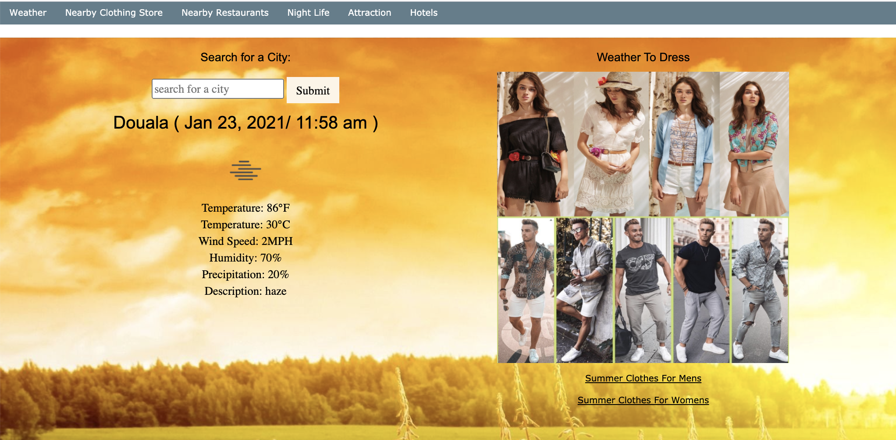
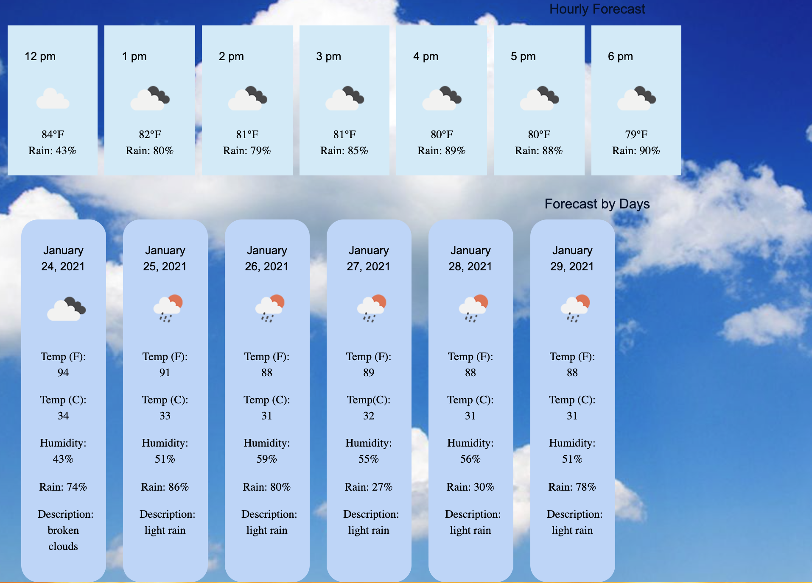
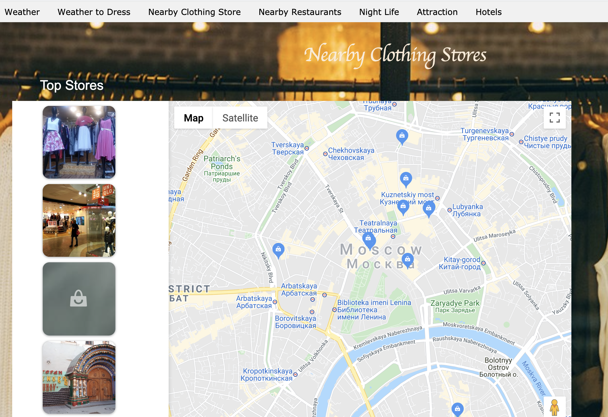
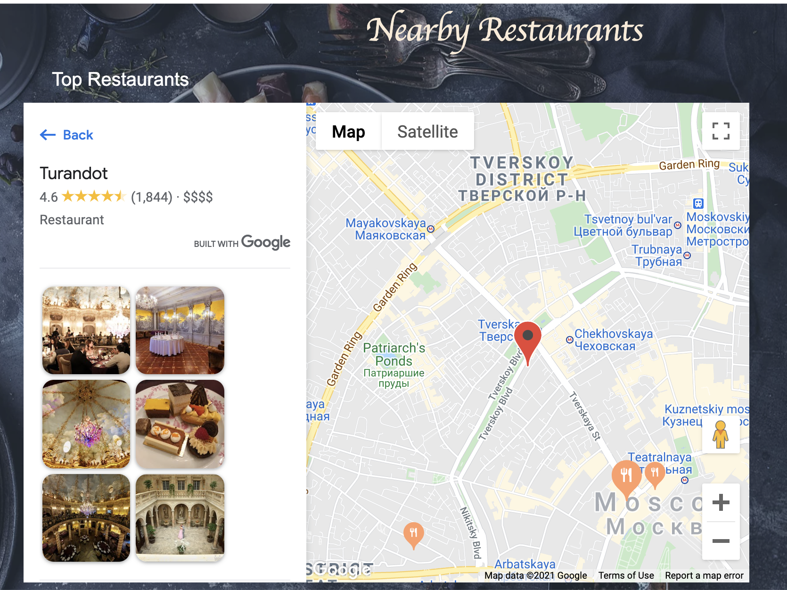
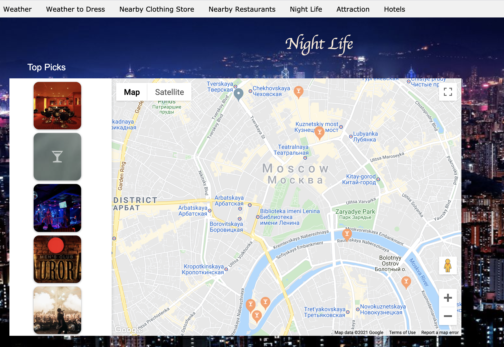
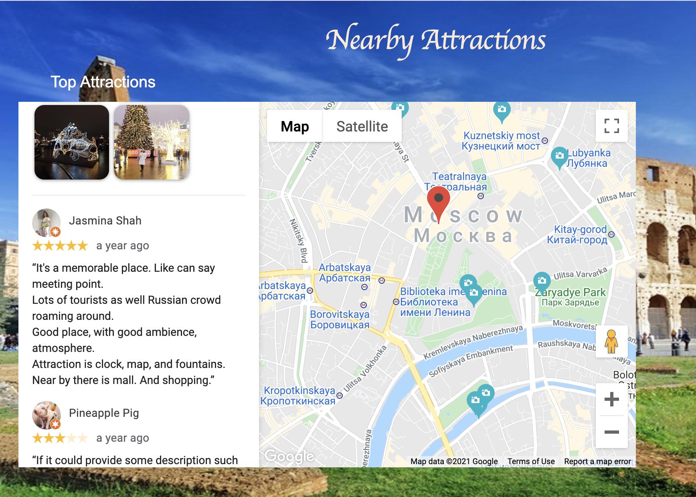
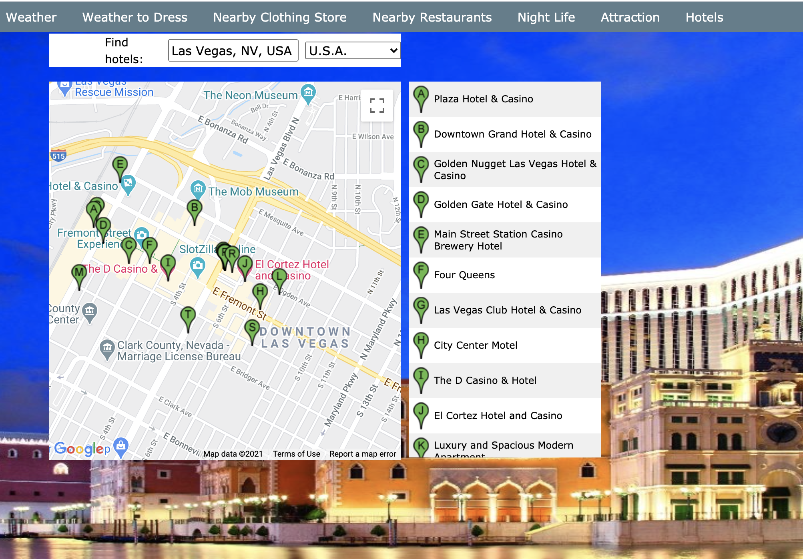

Style-With-My-Weather-App
### Description:
This website is primarily for tourist however, anyone can use it. It will help them to get the temperature for the city travelled, book hotel, know how to dress, know nearby clothing stores, nearby restaurants, night life, attractions, and hotels to achieve a fun day roaming around their location. For each of these pages the google map will load pictures of the destination, reviews, and price range. This website is beneficial because it includes everything they need to know to get through the city all on one website. The recent city searched is saved to local storage and automatically loads all of the map pages except hotels. Hotel pages gives you the option to search for hotels in other cities. 

## APIs
[Open Weather Map](https://openweathermap.org/)

[Google Maps](https://cloud.google.com/maps-platform)

## Web-View:
For you to maneuver through this application with any problems the user will type in the city they wish to search on the weather tab. The user will be presented with a layout of the weather forecast up to the next 6 hours as well as the predicted forecast for the next 5 days, detailing the temperature in both fahrenheit and celsius, humidity, and precipitation. When the user tabs over to one of the other tabs, night life, clothing stores, attractions, hotels or restaurants they will be able to have their previous search on these pages pull up in the new tabs. With the hotel tab the user would need to search for their city once again for the API to generate the pop ups of nearby hotels that they may check into.

These are the screenshots of what our website looks like:

#### GitHub Profile of Collaborators:
[Erum](https://github.com/erumd)
||
[Gregory](https://github.com/NGUENANG7)
||
[Quincy](https://github.com/Q-Jones92)
||
[Dennis](https://github.com/Desparta05)

## Features
Current weather, hourly , and daily forecast
How to dress for the weather
Map with nearby clothing clothes 
Map with nearby restaurants
Map with nearby night life
Map with nearby attractions 
map with nearby hotels 

## Future Development:
Add flight booking site
Current News about the city 

## MIT License

Copyright (c) [2021] [Style-With-Weather-App]

Permission is hereby granted, free of charge, to any person obtaining a copy
of this software and associated documentation files (the "Software"), to deal
in the Software without restriction, including without limitation the rights
to use, copy, modify, merge, publish, distribute, sublicense, and/or sell
copies of the Software, and to permit persons to whom the Software is
furnished to do so, subject to the following conditions:

The above copyright notice and this permission notice shall be included in all
copies or substantial portions of the Software.

THE SOFTWARE IS PROVIDED "AS IS", WITHOUT WARRANTY OF ANY KIND, EXPRESS OR
IMPLIED, INCLUDING BUT NOT LIMITED TO THE WARRANTIES OF MERCHANTABILITY,
FITNESS FOR A PARTICULAR PURPOSE AND NONINFRINGEMENT. IN NO EVENT SHALL THE
AUTHORS OR COPYRIGHT HOLDERS BE LIABLE FOR ANY CLAIM, DAMAGES OR OTHER
LIABILITY, WHETHER IN AN ACTION OF CONTRACT, TORT OR OTHERWISE, ARISING FROM,
OUT OF OR IN CONNECTION WITH THE SOFTWARE OR THE USE OR OTHER DEALINGS IN THE
SOFTWARE.

## Links
https://github.com/Q-Jones92/Style-With-My-Weather-App

[Launch Style With My Weather App](https://q-jones92.github.io/Style-With-My-Weather-App/)

